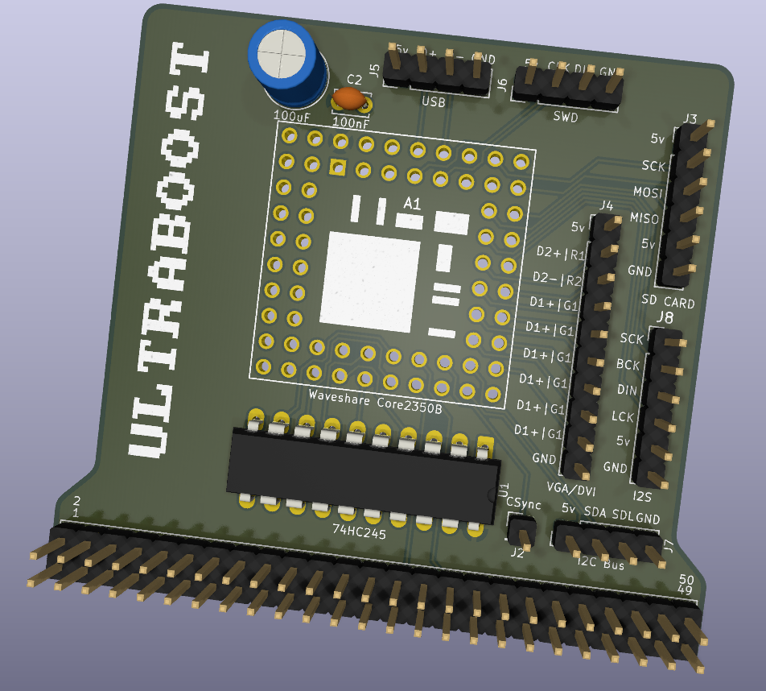

# UltraBoost - Complete Feature Summary!



*pcb image is not final!

# CPC V9990 Accelerator Card — Design Reference v6

**MCU module:** Waveshare Core2350B (RP2350B + 8 MB PSRAM + 16 MB flash onboard)

**CPC compatibility:** 464 upgraded to full 6128 (128 KB RAM + 6128 BASIC + AMSDOS)

**ROM images in flash:** CPC 6128 BASIC (16 KB) · CPC 6128 AMSDOS (16 KB) · Accelerator ROM slot 5 (16 KB)

**System clock:** 294 MHz (PLL_SYS exact — see section 7)

**Bus transceiver:** 74LVC245 — the only external logic IC

**Colour output:** RGB555 — 15-bit, 32,768 colours

**V9990 ports:** &FF60–&FF6F (GFX9000 compatible — SymbOS driver unmodified)

**Coprocessor ports:** &FF40–&FF4F (math + 3D rasteriser)

**Accelerator ROM:** CPC upper ROM slot 5 (auto-installs RSX on boot — within 464 scan range)

**Reserved GPIO:** GPIO0 (boot select) · GPIO47 (PSRAM CS — SDK managed)

**Active GPIO:** GPIO1–GPIO46 = 46 pins, no gaps

---

# PART 1 — HARDWARE

---

## 1. Design Overview

The card plugs into the CPC 50-pin expansion connector. From the CPC's perspective it looks like four things at once:

**1. Full 128 KB CPC RAM** — emulating a CPC 6128. All 8 memory banking configurations are supported via the Gate Array &C0 command. The CPC's internal RAM chips are disabled via RAMDIS. A CPC 464 fitted with this card has 128 KB RAM with the full 6128 banking scheme.

**2. A V9990 VDP at ports &FF60–&FF6F.** Electrically equivalent to a GFX9000 card. SymbOS's existing GFX9000 CPC driver works without a single byte changed.

**3. CPC 6128 ROM set.** The 6128 BASIC ROM (16 KB) and AMSDOS ROM (16 KB) are stored in the RP2350B's 16 MB flash and served to the Z80. ROMDIS is permanently hardwired HIGH (tied to +5 V via resistor), permanently disabling the CPC's own ROM chips. We serve all ROMs ourselves. A CPC 464 boots into 6128 BASIC with full disc support.

**4. A math and 3D coprocessor at ports &FF40–&FF4F.** Hardware multiply, trig, matrix transforms, perspective projection, and textured 3D triangle rasterisation, all running asynchronously on Core 1.

On power-on the card immediately boots into CPC native display mode — reconstructing the CPC screen from emulated RAM and driving it to VGA. The user sees the BASIC start screen on their VGA monitor within one video frame.

---

## 2. Why No /WAIT

At 294 MHz the RP2350B has 432 ns of margin to respond to any Z80 memory read. No /WAIT is ever needed.

```
Z80 at 4 MHz — data must be valid within ~500 ns of /MREQ falling

RP2350B response:
  CPC address bus propagation to GPIO (direct, no resistors)    ~4 ns
  PIO detects /MREQ + /WR high, pushes address to FIFO         ~14 ns
  Core 0 IRQ entry (12 cycles @ 294 MHz)                       ~41 ns
  SRAM lookup + GPIO drive                                       ~6 ns
  74LVC245 propagation + PCB                                    ~8 ns
  ────────────────────────────────────────────────────────────
  Total                                                         ~73 ns
  Margin to Z80 data sample:  500 - 73 = 427 ns  ✓
```

For Z80 I/O cycles (1 µs at 4 MHz) the margin is ~930 ns — all math coprocessor
commands complete long before the Z80 can even finish sending the operand bytes.

---

## 3. Signal Reduction — Three Control Signals Only

All Z80 bus cycle types are fully identified by just /MREQ and /WR together:

| /MREQ | /WR | Cycle | Action |
|-------|-----|-------|--------|
| 0 | 1 | Memory read (including opcode fetch) | Serve RAM byte |
| 0 | 0 | Memory write | Store to emulated_ram[] |
| 1 | 0 | I/O write — OUT (C),r | Decode port, dispatch |
| 1 | 1 | I/O read, IRQ ack, or idle | Pre-loaded status |

**/IORQ** — not needed. I/O write = /MREQ high + /WR low. Unambiguous.
**/RD** — not needed. Memory read = /MREQ low + /WR high. Unambiguous.
**/M1** — not needed. Interrupt acknowledge has /WR high — never triggers write handler.
**DRAM refresh** — /MREQ low + /WR high, treated as memory read. Z80 discards the data. Harmless on SRAM.

Dropping these three signals freed exactly three GPIO pins — used for the 5th colour bit per channel to upgrade from RGB444 to RGB555.

---

## 4. GPIO Map

All bus-facing signals occupy GPIO1–29 and route toward the CPC connector side of the PCB. All VGA signals occupy GPIO30–46 and route toward the DE-15 side. Clean physical separation for PCB layout.

### Group A — CPC Address Bus (GPIO1–16)

| GPIO | Signal | Dir | Notes |
|------|--------|-----|-------|
| 1–16 | A0–A15 | IN | Direct to RP2350B. PIO IN_BASE=GPIO1. No series resistors — RP2350B inputs are 5 V tolerant for reading. Z80 always drives these lines — no pull-downs needed. |

### Group B — CPC Data Bus via 74LVC245 (GPIO17–24)

| GPIO | Signal | Dir | Notes |
|------|--------|-----|-------|
| 17–24 | D0–D7 | BIDIR | Through 74LVC245 (5 V supply). CPC side is native 5 V. RP2350B side is 3.3 V — handled by the LVC245 output stage naturally. Direction: GPIO25. Enable: GPIO26. PIO OUT_BASE=GPIO17. |

### Group C — 74LVC245 Bus Transceiver Control (GPIO25–26)

| GPIO | Signal | Dir | Notes |
|------|--------|-----|-------|
| 25 | 245 DIR | OUT | HIGH = RP2350B drives bus (RAM/status reads). LOW = CPC drives bus (writes). Default LOW. |
| 26 | 245 /OE | OUT | LOW = bus active. HIGH = high-Z (bus disconnected). Default HIGH. |

### Group D — Z80 Control Signals (GPIO27–29)

| GPIO | Signal | Dir | Notes |
|------|--------|-----|-------|
| 27 | /MREQ  | IN | 10 kΩ pull-up. PIO wait target for memory read SM. |
| 28 | /WR    | IN | 10 kΩ pull-up. PIO JMP_PIN — write snooper fires on falling edge. |
| 29 | /RESET | IN | 10 kΩ pull-up. Triggers full card reinitialisation. |

### Group E — VGA Sync (GPIO30–31)

| GPIO | Signal | Dir | Notes |
|------|--------|-----|-------|
| 30 | HSYNC | OUT | PIO1 SM0. Active low. DE-15 pin 13. 3.3 V direct. |
| 31 | VSYNC | OUT | PIO1 SM0. Active low. DE-15 pin 14. |

### Group F — RGB555 Colour DAC (GPIO32–46)

PIO OUT_BASE=GPIO32. `out pins,15` drives one pixel in a single instruction.
Two pixels packed per 32-bit DMA word (15 bits + 15 bits + 2 padding).

| GPIO | Signal | Resistor | Channel |
|------|--------|---------|---------|
| 32 | B0 LSB | 10 kΩ | → VGA Blue (DE-15 pin 3) |
| 33 | B1     | 4.7 kΩ | |
| 34 | B2     | 2.2 kΩ | |
| 35 | B3     | 1.0 kΩ | |
| 36 | B4 MSB | 560 Ω  | |
| 37 | G0 LSB | 10 kΩ | → VGA Green (DE-15 pin 2) |
| 38 | G1     | 4.7 kΩ | |
| 39 | G2     | 2.2 kΩ | |
| 40 | G3     | 1.0 kΩ | |
| 41 | G4 MSB | 560 Ω  | |
| 42 | R0 LSB | 10 kΩ | → VGA Red (DE-15 pin 1) |
| 43 | R1     | 4.7 kΩ | |
| 44 | R2     | 2.2 kΩ | |
| 45 | R3     | 1.0 kΩ | |
| 46 | R4 MSB | 560 Ω  | |

**Total: 16 + 8 + 2 + 3 + 2 + 15 = 46 GPIO. GPIO1–GPIO46, no gaps.**

---

## 5. RGB555 DAC

Binary-weighted resistor ladder into 75 Ω VGA termination (inside the monitor).

```
GPIO_B4 (MSB) ──[560 Ω]──┐
GPIO_B3       ──[1.0 kΩ]─┤
GPIO_B2       ──[2.2 kΩ]─┼── VGA Blue (pin 3) ── 75 Ω → GND (in monitor)
GPIO_B1       ──[4.7 kΩ]─┤
GPIO_B0 (LSB) ──[10 kΩ]──┘

Green and Red channels: identical ladder → VGA pins 2 and 1 respectively
HSYNC ──────────────────── VGA pin 13  (3.3 V direct, no resistor)
VSYNC ──────────────────── VGA pin 14  (3.3 V direct, no resistor)
GND ────────────────────── VGA pins 5, 6, 7, 8, 10
```

All 5 bits high: ≈ 0.694 V into 75 Ω (VGA spec max 0.7 V ✓).
LSB step ≈ 0.022 V. Use 1% tolerance resistors. Place close to DE-15.
**Total: 15 resistors (5 per channel × 3 channels).**

---

## 6. Hardware BOM

| Qty | Part | Package | Notes |
|-----|------|---------|-------|
| 1 | Waveshare Core2350B (8 MB PSRAM) | Stamp module — 2.54 mm pin headers | Main MCU. Onboard 3.3 V LDO, 16 MB flash, 8 MB PSRAM. Solder to PCB via pin headers. |
| 1 | 74LVC245 | DIP-20 | Data bus transceiver. Powered from CPC +5 V directly. 5 V CPC side, 3.3 V RP2350B side handled by LVC output stage. Socket recommended. |
| 1 | 4.7 kΩ | Axial 1/4 W | ROMDIS hardwired HIGH — ties CPC expansion pin 44 to +5 V permanently |
| 3 | 560 Ω 1% | Axial 1/4 W | VGA R4/G4/B4 MSB |
| 3 | 1.0 kΩ 1% | Axial 1/4 W | VGA R3/G3/B3 |
| 3 | 2.2 kΩ 1% | Axial 1/4 W | VGA R2/G2/B2 |
| 3 | 4.7 kΩ 1% | Axial 1/4 W | VGA R1/G1/B1 |
| 3 | 10 kΩ 1% | Axial 1/4 W | VGA R0/G0/B0 LSB |
| 3 | 33 Ω | Axial 1/4 W | Control signal damping /MREQ, /WR, /RESET (optional — see PCB notes) |
| 3 | 10 kΩ | Axial 1/4 W | Pull-ups on /MREQ, /WR, /RESET — safe state when CPC absent |
| 3 | 100 nF | Disc ceramic, 2.54 mm pitch | Decoupling — one on VBUS, one on 3.3 V output pin, one on 74LVC245 VCC (5 V) |
| 2 | 10 µF 16 V | Electrolytic, radial | Bulk decoupling — one on VBUS/5 V rail, one on 3.3 V output pin |
| 1 | DE-15 female | PCB mount THT | VGA output |
| 1 | 50-pin right angle pin header | 2.54 mm pitch, 2×25 | CPC expansion bus — right angle so card sits flat in MX4-compatible backplane |
| 1 | 2-pin header + jumper | 2.54 mm | Bus disconnect for development |
| 1 | Tactile button | THT 6×6 mm | GPIO0 to GND — BOOTSEL for firmware update |

No external LDO required. 3.3 V is provided by the onboard regulator on the Core2350B module.

**ROM images required in flash:** CPC 6128 BASIC ROM (16 KB) and CPC 6128 AMSDOS ROM (16 KB).
These are copyrighted by Amstrad/Locomotive Software. Amstrad have granted permission for
free non-commercial use of CPC ROM images. Include as binary blobs in the firmware build.

---

## 7. PCB Design Notes

- **GPIO47:** Do not connect. PSRAM CS is wired internally on the Core2350B module.
- **CPC connector:** 50-pin right angle 2×25 pin header at 2.54 mm pitch, mounted on the top edge of the board with pins pointing horizontally to plug into the MX4-compatible backplane socket. Components sit on the same face. Verify pin order matches the MX4 bus pinout before ordering.
- **Card dimensions:** Keep the PCB width compatible with the MX4 slot spacing. Check the backplane slot pitch before finalising the board outline.
- **Address bus:** Connect A0–A15 directly from CPC connector to RP2350B GPIO1–16 with no series resistors. The RP2350B inputs are 5 V tolerant in read mode and have been demonstrated to work reliably reading the CPC address bus. Series resistors add RC delay that hurts PIO timing — omit them.
- **Control signals:** 33 Ω series resistors on /MREQ, /WR, /RESET are optional. Omit them for best timing. Include them only if signal integrity issues appear during testing (unlikely at CPC bus speeds).
- **VGA resistors:** Place all 15 resistors close to the DE-15 connector. Keep a separate ground region under the DAC area to avoid digital noise coupling into the analogue signal. Use 1% tolerance axial resistors for accurate voltage levels.
- **Pull-ups:** 10 kΩ pull-ups on /MREQ, /WR, /RESET to 3.3 V — ensures safe state when CPC is powered off or card is used standalone.
- **Bus jumper:** A 2-pin jumper to break the CPC data bus connection is essential for development — allows powering and testing the Core2350B independently.
- **RAMDIS:** Connect CPC expansion pin 45 (RAMDIS) to a dedicated GPIO output (or permanent pull-up). HIGH disables the CPC's internal RAM chips. Always assert RAMDIS — we serve all 128 KB from our SRAM.
- **ROMDIS:** Hardwire CPC expansion pin 44 (ROMDIS) permanently HIGH via a 4.7 kΩ resistor to +5 V — identical approach to RAMDIS. Since we serve all ROMs ourselves (BASIC, AMSDOS, slot 5), the CPC's onboard ROM chips are never needed and can be permanently disabled. No transistor, no GPIO connection required.
- **Decoupling:** 100 nF ceramic and 10 µF electrolytic on the VBUS (5 V) rail and on the 3.3 V output pin of the Core2350B module. Additional 100 nF ceramic directly on the 74LVC245 VCC pin (pin 20). The 74LVC245 runs from CPC +5 V — keep its VCC decoupling cap close to the chip.

---

# PART 2 — PORT MAP AND ADDRESSING

---

## 8. CPC I/O Port Architecture

The CPC uses full 16-bit I/O addresses. The Z80 `OUT (C),r` instruction puts the **B register** on A15–A8 (device select) and the **C register** on A7–A0 (register select). All our ports use B=&FF.

### Why &FFxx is a safe address range

`&FF` in binary is `1111 1111`. The CPC uses partial address decoding — each internal device responds when one specific bit is 0. Since all bits in &FF are 1, no internal CPC hardware responds:

| Bit | CPC device | Trigger | In &FF | Safe? |
|-----|-----------|---------|--------|-------|
| A15 | Gate Array | A15=0 | 1 | ✓ |
| A14 | CRTC 6845 | A14=0 | 1 | ✓ |
| A13 | ROM select | A13=0 | 1 | ✓ |
| A12 | Printer port | A12=0 | 1 | ✓ |
| A11 | PPI 8255 | A11=0 | 1 | ✓ |
| A10 | Expansion bus | A10=0 | 1 | ✓ |

Verified against the full CPCWiki I/O port list. Known nearby hardware: SYMBiFACE II/III at &FD00–&FD4F, M4 Board at &FC00 and &FE00, Albireo at &FE80–&FEBF — none conflict.

**&FCxx is not used** — it conflicts with the M4 board ACK/KICK mechanism.

### Z80 coding rules

Always use `OUT (C),r` with B=&FF. Never use `OUT (n),A`. Never use `OTIR` or `OTDR` — they decrement B, destroying the device selector.

```asm
; Correct — B stays &FF throughout
    LD B, &FF
    LD C, &60        ; V9990 VRAM data port
    LD A, data
    OUT (C), A

; Streaming bytes — use D as counter, never B
SEND_LOOP:
    LD A, (HL) : INC HL
    OUT (C), A          ; B remains &FF
    DEC D : JR NZ, SEND_LOOP
```

---

## 9. V9990 Port Map — &FF60 to &FF6F

The V9990 is the Yamaha graphics chip used in the GFX9000 MSX card. Our implementation at &FF60–&FF6F is electrically compatible with the GFX9000 CPC adapter. SymbOS's existing driver works unmodified.

**Palette note:** The V9990 stores palette entries as RGB333 (3 bits per channel, 8 levels each = 512 palette colours). This is the V9990 chip specification — our card accepts these values at &FF61 and internally converts them to RGB555 for the DAC output. In B1 bitmap mode, 16-bit RGB555 pixels go directly to VRAM at &FF60 and bypass the palette entirely.

| Port | B:C | Dir | Function |
|------|-----|-----|---------|
| &FF60 | &FF:&60 | R/W | VRAM data — auto-increments address pointer each access |
| &FF61 | &FF:&61 | W | Palette data — RGB333 format, auto-incrementing pointer |
| &FF63 | &FF:&63 | R/W | Register data — reads/writes register selected by &FF64 |
| &FF64 | &FF:&64 | W=select / R=status | Write: select register 0–63. Read: CE TR EO BD VR HR flags |
| &FF65 | &FF:&65 | W | Command data — blitter command parameters (LMMC, LMMV, LMMM etc.) |
| &FF67 | &FF:&67 | W | System control — soft reset, XTAL select, VRAM size |
| &FF6F | &FF:&6F | W | Output/interrupt control — display enable, IRQ enables |

### V9990 screen modes

| Mode | Resolution | Depth | VGA output | Primary use |
|------|-----------|-------|-----------|-------------|
| P1 (2-plane) | 256×212 | 4bpp, 61 colours | 640×480@60 | SymbOS desktop |
| B1 (bitmap) | 256×212 | 16bpp RGB555 | 640×480@60 | Full colour graphics |
| B3 (bitmap) | 512×212 | 8bpp, 256 colours | 640×480@60 | Wide bitmap |
| B5 (bitmap) | 768×212 | 4bpp | 800×600@60 | Wide desktop |
| B7 (bitmap) | 1024×212 | 4bpp | 1024×768@60 | Maximum width |

---

## 10. Coprocessor Port Map — &FF40 to &FF4F

Verified clean gap in the port list: above CPC Booster (&FF00–&FF28), well below V9990 (&FF60). Nothing assigned here in the full CPCWiki port table.

| Port | B:C | Dir | Function |
|------|-----|-----|---------|
| &FF40 | &FF:&40 | W | CMD — write command opcode to start a command |
| &FF41 | &FF:&41 | W | DATA_IN — stream operand bytes after CMD |
| &FF42 | &FF:&42 | R | DATA_OUT — read result bytes after BUSY clears |
| &FF43 | &FF:&43 | R | STATUS — bit0=BUSY bit1=READY bit2=OVF bit3=DIV0 bit7=QFULL |
| &FF44–&FF46 | &FF:&44–&46 | W | ZBUF_ADDR — 24-bit PSRAM address of Z-buffer (3 bytes, LSB first) |
| &FF47–&FF49 | &FF:&47–&49 | W | TEX_ADDR — 24-bit PSRAM address of current texture (3 bytes, LSB first) |
| &FF4A–&FF4F | — | — | Reserved |

---

## 11. Coprocessor Command Set

Poll &FF43 STATUS bit 0 (BUSY=0) before reading any result. In practice, all math operations complete in well under 1 µs — faster than the Z80 can execute even two instructions.

### System (opcodes &00–&05)

| Opcode | Name | Operands → &FF41 | Result from &FF42 | Description |
|--------|------|-----------------|-------------------|-------------|
| &00 | NOP | none | none | No operation |
| &01 | VERSION | none | 2 bytes (major, minor) | Card firmware version |
| &02 | ZBUF_CLEAR | none | none | Fill Z-buffer with &FFFF via DMA |
| &03 | SET_VIEWPORT | x(2), y(2), w(2), h(2) | none | 3D clip rectangle |
| &04 | TEX_SIZE | w(1), h(1) | none | Current texture dimensions (power of 2) |
| &05 | SET_VGA_MODE | mode(1) | none | Switch display mode (see section 13) |

### Integer Arithmetic (opcodes &10–&13)

| Opcode | Name | Operands | Result | Speed |
|--------|------|----------|--------|-------|
| &10 | MUL16 | A(2), B(2) | product(4) | 1 cycle — hardware multiplier |
| &11 | MUL32 | A(4), B(4) | product lo(4) | 1 cycle |
| &12 | DIV16 | dividend(2), divisor(2) | quotient(2) + remainder(2) | ~10 cycles |
| &13 | SQRT32 | value(4) | root(2) | ~15 cycles |

### Trigonometry and Fixed-Point (opcodes &20–&23)

Angles 0–255 = 0°–359°. Fixed-point: 8.8 = 8-bit integer + 8-bit fraction. 16.16 = 16-bit integer + 16-bit fraction.

| Opcode | Name | Operands | Result | Notes |
|--------|------|----------|--------|-------|
| &20 | SIN | angle(1) | sin(2) as 8.8 | 256-entry lookup — instantaneous |
| &21 | COS | angle(1) | cos(2) as 8.8 | Same table, offset by 64 |
| &22 | ATAN2 | y(2), x(2) | angle(1) | ~20 cycles |
| &23 | FP_MUL | A(4) 16.16, B(4) 16.16 | result(4) 16.16 | Hardware multiply + shift |

### 3D Vector and Matrix (opcodes &30–&33)

All values 16.16 fixed-point (4 bytes each).

| Opcode | Name | Operands | Result | Use |
|--------|------|----------|--------|-----|
| &30 | VEC_DOT | A.xyz(12), B.xyz(12) | dot(4) | Lighting, back-face cull |
| &31 | VEC_CROSS | A.xyz(12), B.xyz(12) | result.xyz(12) | Surface normals |
| &32 | MAT_TRANSFORM | matrix 4×4(64), vertex xyzw(16) | result xyzw(16) | Full MVP transform |
| &33 | PERSPECTIVE | x, y, z, focal(16) | sx, sy, 1/z(12) | Perspective divide |

### 3D Rasteriser (opcodes &40–&46)

All draw commands are **non-blocking** — they queue to Core 1 and return immediately. The Z80 can queue the next triangle while the previous one is being rasterised. Check STATUS bit 7 (QFULL) before sending if rapid-firing many triangles.

| Opcode | Name | Operands (→ &FF41) | Description |
|--------|------|---------------------|-------------|
| &40 | TRI_FLAT | x1,y1, x2,y2, x3,y3, col — 14 bytes | Solid colour triangle, no depth test |
| &41 | TRI_FLAT_Z | x1,y1,z1 … x3,y3,z3, col — 20 bytes | Solid colour + Z-buffer depth test |
| &42 | TRI_TEXTURED | x1,y1,u1,v1 … x3,y3,u3,v3 — 24 bytes | Textured triangle, affine UV, no depth |
| &43 | TRI_TEXTURED_Z | x1,y1,z1,u1,v1 … x3,y3,z3,u3,v3 — 30 bytes | Textured + Z-buffer — primary 3D command |
| &44 | SPAN_DRAW | x_start, x_end, y, u, v, du, dv — 14 bytes | Raw textured scanline span |
| &45 | LINE_3D | x1,y1,z1, x2,y2,z2, col — 14 bytes | Z-tested wireframe line |
| &46 | BILLBOARD | x, y, z, tex_w, tex_h, scale — 12 bytes | Perspective-scaled sprite at 3D position |

---

# PART 3 — FIRMWARE

---

## 12. Firmware Architecture

### Core 0 — real-time bus handler

Core 0 is entirely interrupt-driven. It handles every Z80 bus cycle with deterministic latency.

```
PIO SM0 — unified write snooper
  Fires on every /WR falling edge
  in pins,32 captures entire bus state (address + data + control) in one instruction
  Pushes 32-bit word to FIFO immediately

Core 0 main loop — pops FIFO and routes:
  /MREQ bit = 0, /WR = 0  →  RAM write → emulated_ram[addr] = data
  /MREQ bit = 0, /WR = 1  →  (handled by SM1 IRQ — see below)
  /MREQ bit = 1, /WR = 0, B=&FF, C=&60–&6F  →  V9990 write handler
  /MREQ bit = 1, /WR = 0, B=&FF, C=&40–&4F  →  Coprocessor write handler
  /MREQ bit = 1, /WR = 0, B=&DF             →  ROM select snoop (saves current slot)

PIO SM1 — memory read handler
  Detects /MREQ=0 + /WR=1
  Raises IRQ to Core 0
  Core 0 ISR: looks up emulated_ram[addr] (or ROM if applicable)
              drives result onto D0–D7 via GPIO + 74LVC245
              total latency ~73 ns — well within Z80 timing

ROMEN (CPC expansion pin 42) — not connected, not needed:
  ROMEN is driven LOW by the Gate Array whenever a ROM region is being addressed.
  Real ROM expansion boards wire ROMEN to their chip /CS.
  We do not connect ROMEN. Instead we replicate the Gate Array's ROM-enable
  logic entirely in software using a shadow of the Gate Array config register.

  The Gate Array enables a ROM region when:
    lower ROM: A15=0 AND A14=0 AND lower_rom_enable_bit = 1  (addr &0000-&3FFF)
    upper ROM: A15=1             AND upper_rom_enable_bit = 1  (addr &C000-&FFFF)

  We maintain lower_rom_enabled and upper_rom_enabled flags by snooping every
  write to &7Fxx (Gate Array port, A15=0 AND A14=1). Bit 2 of the data byte
  controls lower ROM, bit 3 controls upper ROM.

  The shadow is initialised to the CPC power-on state (both ROMs enabled, slot 0)
  before /RESET is released — so the very first Z80 instruction fetch is handled
  correctly. No startup race condition exists.

  This approach is reliable because Gate Array config writes always precede the
  ROM read cycles they affect — the Z80 cannot change ROM enable state mid-cycle.

ROM handling (Core 0 RAM read ISR):
  addr &0000-&3FFF + lower_rom_enabled = true   ->  serve cpc6128_basic[] from flash
  addr &0000-&3FFF + lower_rom_enabled = false  ->  serve RAM page 0 (normal RAM access)
  addr &C000-&FFFF + upper_rom_enabled = true,  slot 0  ->  serve cpc6128_basic[] (BASIC at &C000)
  addr &C000-&FFFF + upper_rom_enabled = true,  slot 5  ->  serve accel_rom[]
  addr &C000-&FFFF + upper_rom_enabled = true,  slot 7  ->  serve cpc6128_amsdos[] (AMSDOS)
  addr &C000-&FFFF + upper_rom_enabled = true,  other   ->  drive &FF (empty slot)
  addr &C000-&FFFF + upper_rom_enabled = false  ->  serve RAM page 3 (normal RAM access)
  all other addresses                            ->  serve from banked RAM pages

  All ROM data comes from RP2350B flash via XIP — zero SRAM cost.
  ROMDIS is hardwired HIGH — CPC ROM chips are permanently disabled.
  No bus conflict possible at any time.

Status outputs:
  Pre-loads &FF43 (copro STATUS) and &FF64 (V9990 STATUS) into TX FIFOs
  Drives /INT line to CPC on V9990 frame, line, or command-complete events
```

### Core 1 — three-priority multiplex engine

```
Priority 1 (DMA IRQ, preempts everything else):
  VGA scanline renderer
  Fires every 31.75 µs at 640×480@60 Hz
  Reads VRAM from PSRAM, decodes V9990 pixel format (P1/B1/B3/B5/B7)
  Composites hardware sprites
  Writes to double-buffered SRAM line buffer for DMA output
  Uses ~35% of Core 1 time during active display

Priority 2 (runs in gaps between scanline renders):
  Math coprocessor command execution
  Pops commands from ring buffer, executes, writes to result_buf[] in SRAM
  All math operations complete in < 1 µs — effectively instantaneous to Z80

Priority 3 (background, runs in remaining gaps + full vblank period):
  3D triangle rasteriser
  TRI_TEXTURED_Z: reads texture from PSRAM, interpolates UV, Z-tests each pixel
  Renders into PSRAM VRAM (visible on VGA next frame)
  Preempted by scanline IRQ, resumes after
  Full vblank (~1.43 ms) used for burst rasterisation
```

### Power-on boot sequence

```
On /RESET (from CPC or power-on):
  1. Zero all 8 pages of emulated_ram (128 KB total)
  2. Set RAM banking to config 0 — standard layout, all 4 slots from lower 64 KB
  3. Initialise Gate Array shadow: Mode 1 (320x200, 4 colours), default palette,
     lower ROM enabled, upper ROM enabled — mirrors CPC power-on state
  4. Initialise CRTC shadow: R12=&30 R13=0 (screen_base=&C000), standard timings
  5. Set PLL_USB for 25.2 MHz pixel clock -> 640x480@60 Hz VGA
  6. Start VGA PIO1 — display mode = CPC_NATIVE (reconstruct from emulated_ram)
  7. Assert RAMDIS — disables CPC's internal RAM chips (we serve all RAM)
  8. Release /RESET — Z80 begins executing

  The Z80 reads from &0000. Gate Array has lower ROM enabled.
  Our card serves the CPC 6128 BASIC ROM from flash. ROMDIS is hardwired HIGH —
  the CPC's own ROM chips are permanently disabled. No conflict possible.
  Core 1 simultaneously reconstructs the VGA output from emulated_ram[].
  From the CPC's perspective it is a fully configured 6128 with VGA output.
```

### CPC native screen reconstruction (Core 1)

The CPC screen is not a linear framebuffer. Character rows are stored with 2048 bytes between consecutive scan lines within the same character row. Core 1 implements this exactly:

```c
// addr = screen_base + (cpc_y/8)*80 + (cpc_y%8)*2048 + byte_x
void reconstruct_cpc_scanline(int vga_y, uint16_t *line_buf) {
    int cpc_y = (vga_y < 40 || vga_y >= 440) ? -1 : (vga_y - 40) / 2;
    if (cpc_y < 0) { fill_border(line_buf); return; }

    uint16_t base  = ((crtc_regs[12] & 0x3F) << 9) | (crtc_regs[13] << 1);
    int char_row   = cpc_y / 8;
    int line_in_ch = cpc_y % 8;

    for (int bx = 0; bx < 80; bx++) {
        uint16_t addr = (base + char_row*80 + line_in_ch*2048 + bx) & 0x3FFF;
        uint8_t byte  = emulated_ram[0x4000 + addr];
        decode_pixel(byte, bx, ga_mode, line_buf);  // handles modes 0, 1, 2
    }
}

// Mode 0: 2 pixels/byte, 4 bits/pixel (16 colours, 160×200)
// Mode 1: 4 pixels/byte, 2 bits/pixel (4 colours, 320×200) — SymbOS default
// Mode 2: 8 pixels/byte, 1 bit/pixel  (2 colours, 640×200)
// All modes 2× pixel-doubled to fill 640 output pixels per line
```

---

## 13. VGA Output — Dual PLL Pixel Clock Architecture

### Why two PLLs

The RP2350B has two independent PLLs. Separating them means video mode changes never affect the CPU or bus handler:

- **PLL_SYS — fixed at 294 MHz.** Drives CPU cores, SRAM, and PIO0 (the bus snooper). Never reprogrammed. `12 × 49 ÷ 2 = 294 MHz` — exact, no VCO compromise.
- **PLL_USB — reprogrammed per video mode.** Drives PIO1 only (VGA pixel serialiser and sync). Changing it has zero effect on PIO0, Core 0, or Core 1.

On a mode switch: Core 1 stops PIO1, reprograms PLL_USB (~200 µs lock time = 1–2 blank frames), reloads sync timing, restarts PIO1. The Z80 bus keeps running throughout.

### PLL_USB configurations — all target clocks achievable exactly

| Pixel clock | Used by | fbdiv | pd1 | pd2 | VCO MHz | Actual MHz | Error |
|-------------|---------|-------|-----|-----|---------|-----------|-------|
| 25.2 MHz | 640×480@60, 640×400@70 | 63 | 5 | 6 | 756 | 25.200 | 0.099% |
| 31.5 MHz | 640×480@75 | 63 | 4 | 6 | 756 | 31.500 | exact |
| 40.0 MHz | 800×600@60 | 70 | 3 | 7 | 840 | 40.000 | exact |
| 49.5 MHz | 800×600@75 | 66 | 4 | 4 | 792 | 49.500 | exact |
| 50.0 MHz | 800×600@72 | 75 | 3 | 6 | 900 | 50.000 | exact |
| 65.0 MHz | 1024×768@60 | 65 | 2 | 6 | 780 | 65.000 | exact |
| 74.25 MHz | 1280×720@60 | 99 | 4 | 4 | 1188 | 74.250 | exact |
| 75.0 MHz | 1024×768@70 | 75 | 2 | 6 | 900 | 75.000 | exact |
| 78.75 MHz | 1024×768@75 | 105 | 4 | 4 | 1260 | 78.750 | exact |
| 108.0 MHz | 1280×1024@60 | 63 | 1 | 7 | 756 | 108.000 | exact |
| 148.5 MHz | 1920×1080@60 | 99 | 2 | 4 | 1188 | 148.500 | exact |

PLL_USB divider in PIO1 is always set to 1.0 — pixel clock comes out exact from the PLL with no further division.

### PSRAM bandwidth and scanline buffering

**Direct** — DMA reads pixel data from PSRAM straight to PIO1. Used when bandwidth requirement ≤ 60 MB/s.

**2-line-ahead buffer** — Core 1 pre-fetches the next two lines from PSRAM into SRAM line buffers while DMA outputs from SRAM. SRAM internal bandwidth is ~1.2 GB/s — pixel DMA never stalls. Enables modes where PSRAM bandwidth alone would be insufficient.

### All 33 direct VGA framebuffer modes

All use RGB555 (2 bytes/pixel). Framebuffer at PSRAM 0x080000–0x27FFFF (2 MB). SET_VGA_MODE (&05) switches at next frame boundary.

★ = recommended mode for that output resolution.
`buf` = requires 2-line-ahead SRAM scanline buffer.

| # | Render res | → Output @ Hz | FB size | BW req | Method |
|---|-----------|--------------|---------|--------|--------|
| 0 | CPC native | → 640×480@60 | none | — | reconstruct from emulated_ram |
| 1 | 160×120 | → 640×480@60 | 38 KB | 2.5 MB/s | 4×4 upscale |
| 2 | 320×120 | → 640×480@60 | 75 KB | 5.0 MB/s | 2×h 4×v |
| 3 | 320×240 | → 640×480@60 | 150 KB | 10 MB/s | 2×2 upscale |
| 4 | 640×240 | → 640×480@60 | 300 KB | 20 MB/s | double-scan |
| 5 | 640×480 | → 640×480@60 | 600 KB | 40 MB/s | native |
| 6 | 320×200 | → 640×400@70 | 125 KB | 10 MB/s | 2×2 upscale |
| 7 | 640×200 | → 640×400@70 | 250 KB | 20 MB/s | double-scan |
| 8 | 640×400 | → 640×400@70 | 500 KB | 40 MB/s | native |
| 9 | 320×240 | → 640×480@75 | 150 KB | 12 MB/s | 2×2 upscale |
| 10 | 640×240 | → 640×480@75 | 300 KB | 24 MB/s | double-scan |
| 11 | 640×480 | → 640×480@75 | 600 KB | 48 MB/s | native 75 Hz |
| 12 | 200×150 | → 800×600@60 | 59 KB | 3.8 MB/s | 4×4 upscale |
| 13 | 400×300 | → 800×600@60 | 234 KB | 15 MB/s | 2×2 upscale |
| 14 | 800×300 | → 800×600@60 | 469 KB | 30 MB/s | double-scan |
| 15 | 800×600 | → 800×600@60 | 938 KB | 61 MB/s | native buf |
| 16 | 800×300 | → 800×600@72 | 469 KB | 39 MB/s | double-scan |
| 17 | 800×600 | → 800×600@72 | 938 KB | 77 MB/s | native buf |
| 18 | 256×192 | → 1024×768@60 | 96 KB | 6.2 MB/s | 4×4 upscale |
| 19 | 512×384 | → 1024×768@60 | 384 KB | 25 MB/s | 2×2 upscale |
| 20★ | 1024×384 | → 1024×768@60 | 768 KB | 50 MB/s | double-scan |
| 21 | 1024×768 | → 1024×768@60 | 1536 KB | 99 MB/s | native buf |
| 22★ | 1024×384 | → 1024×768@70 | 768 KB | 58 MB/s | double-scan |
| 23 | 1024×768 | → 1024×768@70 | 1536 KB | 116 MB/s | native buf |
| 24 | 320×180 | → 1280×720@60 | 112 KB | 7.2 MB/s | 4×4 upscale |
| 25 | 640×360 | → 1280×720@60 | 450 KB | 29 MB/s | 2×2 upscale |
| 26★ | 1280×360 | → 1280×720@60 | 900 KB | 58 MB/s | double-scan |
| 27 | 1280×720 | → 1280×720@60 | 1800 KB | 115 MB/s | native buf |
| 28 | 320×256 | → 1280×1024@60 | 160 KB | 10 MB/s | 4×4 upscale |
| 29 | 640×512 | → 1280×1024@60 | 640 KB | 41 MB/s | 2×2 upscale |
| 30★ | 1280×512 | → 1280×1024@60 | 1280 KB | 82 MB/s | double-scan buf |
| 31 | 480×270 | → 1920×1080@60 | 253 KB | 16 MB/s | 4×4 upscale |
| 32 | 960×270 | → 1920×1080@60 | 506 KB | 32 MB/s | 2×h 4×v |
| 33★ | 1920×270 | → 1920×1080@60 | 1013 KB | 65 MB/s | 4×v scan buf |

### Frame performance budget (640×480 @ 60 Hz)

| Period | Duration | Core 1 cycles | Used for |
|--------|----------|--------------|---------|
| Per scanline — render | ~11 µs | ~3,300 | Scanline decode + sprite composite |
| Per scanline — free | ~21 µs | ~6,225 | Math commands + ~2,075 triangle pixels |
| Vblank (45 lines) | 1.43 ms | ~426,750 | Burst triangle rasterisation |
| **Total 3D pixels/frame** | — | **~1,137,000** | Sufficient for a real-time 3D game |

Z80 at 4 MHz: ~66,700 cycles/frame. Core 1 at 294 MHz: ~4,900,000 cycles/frame. **Core 1 has 73× more compute than the Z80.**

---

## 14. PSRAM Layout (8 MB)

| Region | Address | Size | Contents |
|--------|---------|------|---------|
| V9990 VRAM | 0x000000–0x07FFFF | 512 KB | Pattern planes, sprite attribute table, palette data |
| VGA framebuffer | 0x080000–0x27FFFF | 2 MB | All direct VGA modes render here (RGB555, 2 bytes/pixel) |
| Z-buffer | 0x280000–0x2FFFFF | 512 KB | 16-bit depth buffer (2 bytes/pixel, 512×256 max) |
| Texture RAM | 0x300000–0x4FFFFF | 2 MB | Game and application textures |
| Backing store | 0x500000–0x7FFFFF | 3 MB | Window save/restore slots, sprite cache, spare |

---

# PART 4 — SOFTWARE

---

## 15. Accelerator ROM — CPC Upper ROM Slot 5

### How CPC upper ROMs work — with our card fitted

The CPC supports up to 32 upper ROM slots (0–31), each appearing at &C000–&FFFF (16 KB) when selected. The Z80 selects a slot with `OUT (&DF), n`. BASIC scans all slots at boot, finds foreground ROMs (type byte = 1), calls their init routines, and registers their RSX commands. **This happens automatically — no LOAD, no CALL needed.**

**Critical difference with our card:** ROMDIS is hardwired permanently HIGH — identical to how RAMDIS is handled. Every CPC ROM chip is disabled at all times. **We are the sole provider of all ROM data.** We serve the CPC 6128 BASIC and AMSDOS images from our flash. No transistor or GPIO connection is needed — just a resistor to +5 V.

This means:
- A CPC 464 gets 6128 BASIC instead of its own older BASIC ROM
- A CPC 464 gets AMSDOS even without a disc interface fitted
- A CPC 6128 gets our ROM images in place of its own — identical content, so no difference in behaviour
- Any ROM expansion hardware that uses other slots will NOT work alongside our card — we are the only ROM provider

| Slot | What we serve |
|------|--------------|
| 0 | CPC 6128 BASIC ROM (16 KB, from RP2350B flash) — same image as lower ROM |
| 1–4 | Empty — we return &FF (unpopulated slot) |
| **5** | **Our accelerator ROM (16 KB, from RP2350B flash)** |
| 6 | Empty — we return &FF |
| 7 | CPC 6128 AMSDOS ROM (16 KB, from RP2350B flash) |
| 8–31 | Empty — we return &FF |

Core 0 snoops ROM select writes (&DFxx, A13=0) to keep `current_upper_rom` up to date. The memory read handler serves all ROM and RAM:

```c
// We are the sole ROM provider. ROMDIS is hardwired HIGH — CPC ROM chips
// are permanently disabled. No bus conflict is possible at any time.

void __not_in_flash_func(handle_memory_read)(uint16_t addr) {

    // Lower ROM region (&0000-&3FFF)
    if (addr < 0x4000) {
        if (lower_rom_enabled)
            drive_data_bus(cpc6128_basic[addr]);   // serve 6128 BASIC from flash
        else
            drive_data_bus(page_map[0][addr]);     // lower ROM disabled — serve RAM page 0
        return;
    }

    // Upper ROM region (&C000-&FFFF)
    if (addr >= 0xC000) {
        uint16_t offset = addr - 0xC000;
        if (upper_rom_enabled) {
            switch (current_upper_rom) {
                case 0:  drive_data_bus(cpc6128_basic[offset]);  return;  // slot 0 = BASIC
                case 5:  drive_data_bus(accel_rom[offset]);       return;  // slot 5 = our accelerator ROM
                case 7:  drive_data_bus(cpc6128_amsdos[offset]); return;  // slot 7 = AMSDOS
                default: drive_data_bus(0xFF);                    return;  // empty slot
            }
        } else {
            drive_data_bus(page_map[3][offset]);   // upper ROM disabled — serve RAM page 3
        }
        return;
    }

    // Middle RAM (&4000-&BFFF) — always RAM, no ROM possible here
    drive_data_bus(page_map[addr >> 14][addr & 0x3FFF]);
}
```

All three ROM arrays live in RP2350B flash, accessed via XIP — zero SRAM cost:
- `cpc6128_basic[]`  16 KB — served at lower ROM region AND upper ROM slot 0
- `cpc6128_amsdos[]` 16 KB — served at upper ROM slot 7
- `accel_rom[]`      16 KB — served at upper ROM slot 5

### ROM memory map (&C000–&FFFF)  —  served in slot 5

```
&C000  ROM header (type=1, mark=&CB, version)
&C003  JP RESET_HANDLER
&C006  RETI  (background entry — not used for type 1)
&C009  JP APP_INIT
&C00C  Product name: "ACCEL V1", 0

&C010  ┌─ Fixed API jump table (78 bytes, 26 × JP nnnn) ─┐
       │  Addresses here NEVER change between ROM versions │
       │  Safe to CALL from user code permanently         │
&C060  └──────────────────────────────────────────────────┘

&C080  RSX name table  (|ACC_MODE |ACC_FILL … |ACC_INFO)
&C200  RSX handler address table  (2 bytes per handler)
&C300  RSX handler code
&C800  ASM library implementation  (jump table targets live here)
&CC00  APP_INIT — card detect, RSX register, default PSRAM addresses
&CD00  CPC colour LUTs  (RGB555 table for 27 hardware colours, Mode 1 masks)
&CE00  VGA mode parameter table
&CF00  Reserved / spare
&FFFF
```

### Fixed API jump table (&C010–&C05D)

Every entry is `JP nnnn` (3 bytes). Addresses are frozen — ROM updates can reorganise everything at &C800+ without breaking existing user code.

```
CALL &C010  ACCEL_WAIT          CALL &C034  MAT_TRANSFORM
CALL &C013  ACCEL_CMD_START     CALL &C037  PERSPECTIVE
CALL &C016  ACCEL_SEND_WORD     CALL &C03A  GFX_FILL_RECT
CALL &C019  ACCEL_READ_WORD     CALL &C03D  GFX_BLIT
CALL &C01C  STREAM_N            CALL &C040  GFX_SCROLL
CALL &C01F  MUL16               CALL &C043  GFX_LINE
CALL &C022  DIV16               CALL &C046  GFX_TRI_Z
CALL &C025  SQRT32              CALL &C049  GFX_CLS
CALL &C028  GET_SIN             CALL &C04C  SET_VGA_MODE
CALL &C02B  GET_COS             CALL &C04F  SET_TEX_ADDR
CALL &C02E  ATAN2               CALL &C052  SET_ZBUF_ADDR
CALL &C031  FP_MUL              CALL &C055  WAIT_VSYNC
                                CALL &C058  V9990_WRITE_VRAM
                                CALL &C05B  V9990_SET_WRITE_ADDR
```

### APP_INIT — called automatically by BASIC on every boot

```asm
APP_INIT:
    ; 1. Detect card — read STATUS, check not &FF
    LD B,&FF : LD C,&43 : IN A,(C) : CP &FF : JR Z,.no_card

    ; 2. Read firmware version
    LD A,&01 : CALL ACCEL_CMD_START  ; VERSION command
    CALL ACCEL_WAIT
    CALL ACCEL_READ_WORD : LD (ROM_VERSION),HL

    ; 3. Register RSX commands with BASIC
    LD HL,RSX_NAMES : LD DE,RSX_TABLE
    CALL &BCCB              ; KL_LOG_EXT

    ; 4. Set default PSRAM addresses
    LD HL,&0000 : LD A,&28 : CALL SET_ZBUF_ADDR  ; Z-buf at &280000
    LD HL,&0000 : LD A,&30 : CALL SET_TEX_ADDR   ; textures at &300000

    ; 5. Boot in CPC native display mode
    LD A,0 : CALL SET_VGA_MODE
    RET

; Note: card is in slot 5. BASIC scans 7 down to 0 on 464, 15 down to 0 on 6128.
; Slot 5 auto-installs on BOTH machines without needing any CALL or LOAD.

.no_card:
    LD HL,MSG_NO_CARD
.pr: LD A,(HL) : INC HL : OR A : RET Z : CALL &BB5A : JR .pr
MSG_NO_CARD: DEFB "ACCEL: card not detected",13,10,0
ROM_VERSION: DEFW 0
```

---

## 16. BASIC RSX Commands

Registered automatically at boot via the ROM. No setup required by the user.

| Command | Parameters | Action |
|---------|-----------|--------|
| `\|ACC_MODE,m` | m = mode ID (0=CPC native, 5=640×480, 15=800×600, etc.) | Switch VGA output mode |
| `\|ACC_FILL,x,y,w,h,col` | col = RGB555 value 0–32767 | Fill rectangle in framebuffer |
| `\|ACC_BLIT,sx,sy,dx,dy,w,h` | — | Copy rectangle within framebuffer |
| `\|ACC_LINE,x1,y1,x2,y2,col` | — | Draw Bresenham line |
| `\|ACC_SCROLL,x,y,w,h,dx,dy` | dx/dy = signed pixel scroll | Scroll a rectangle |
| `\|ACC_CLS,col` | — | Clear entire framebuffer |
| `\|ACC_MUL,a,b,@r` | a, b = 16-bit integers | r = a × b (returned as BASIC float) |
| `\|ACC_DIV,a,b,@q,@r` | — | q = a ÷ b, r = remainder |
| `\|ACC_SQRT,vlo,vhi,@r` | 32-bit value in two 16-bit params | r = integer square root |
| `\|ACC_SIN,ang,@r` | ang = 0–255 | r = sin(ang) × 256, signed integer |
| `\|ACC_COS,ang,@r` | ang = 0–255 | r = cos(ang) × 256, signed integer |
| `\|ACC_VSYNC` | — | Wait for V9990 vertical blank |
| `\|ACC_VWRITE,vaddr,caddr,len` | PSRAM addr, CPC RAM addr, byte count | Copy CPC RAM to V9990 VRAM |
| `\|ACC_VMODE,m` | m = V9990 mode | Switch V9990 screen mode |
| `\|ACC_INFO` | — | Print card version and port info to screen |

### BASIC examples

```basic
10 REM Card RSX active at boot — no LOAD needed
20 |ACC_MODE,5               : REM 640x480 VGA direct
30 |ACC_CLS,0                : REM clear to black
40 FOR C=0 TO 31
50   |ACC_FILL,C*20,100,18,200,C+(C*32)+(C*1024)
60 NEXT C                    : REM colour sweep across screen

70 REM Maths
80 |ACC_MUL,999,999,@R       : PRINT R    : REM prints 998001
90 |ACC_SQRT,2000,0,@R       : PRINT R    : REM prints 44

100 REM Trig circle
110 FOR A=0 TO 255
120   |ACC_SIN,A,@S : |ACC_COS,A,@CO
130   X=320+INT(S*100/256) : Y=240+INT(CO*100/256)
140   |ACC_FILL,X,Y,2,2,31744    : REM bright red dot
150 NEXT A

160 |ACC_MODE,0              : REM back to CPC native
```

---

## 17. Z80 ASM Library

The library lives in the ROM body at &C800+. Call routines via the fixed jump table at &C010. The ROM must be paged in (select slot 5 with `OUT (&DF),5`) and upper ROM must be enabled via the Gate Array config.

### Port constants (for use in user code)

```asm
DEV          EQU &FF    ; B register — device select, always &FF
COPRO_CMD    EQU &40    ; W: command opcode
COPRO_DATA   EQU &41    ; W: operand byte stream
COPRO_RESULT EQU &42    ; R: result byte stream
COPRO_STATUS EQU &43    ; R: BUSY=b0 READY=b1 OVF=b2 DIV0=b3 QFULL=b7
COPRO_ZBUF0  EQU &44    ; W: Z-buffer PSRAM address byte 0 (LSB)
COPRO_ZBUF1  EQU &45    ; W: Z-buffer PSRAM address byte 1
COPRO_ZBUF2  EQU &46    ; W: Z-buffer PSRAM address byte 2 (MSB)
COPRO_TEX0   EQU &47    ; W: texture PSRAM address byte 0
COPRO_TEX1   EQU &48    ; W: texture PSRAM address byte 1
COPRO_TEX2   EQU &49    ; W: texture PSRAM address byte 2
V9990_VRAM   EQU &60    ; R/W: VRAM data, auto-increment
V9990_PAL    EQU &61    ; W: palette (RGB333)
V9990_RDATA  EQU &63    ; R/W: register data
V9990_RSEL   EQU &64    ; W: register select / R: V9990 status
V9990_CMD    EQU &65    ; W: blitter command data
V9990_SYS    EQU &67    ; W: system control
V9990_OUT    EQU &6F    ; W: output/IRQ control
```

### Calling convention

```asm
; All jump table entries preserve the calling code's BC context
; (B is always restored to DEV=&FF on exit from library routines)

; ACCEL_WAIT — poll until BUSY=0  (CALL &C010)
; In: nothing  Out: nothing  Destroys: A, BC

; ACCEL_CMD_START — send opcode, set BC ready for data  (CALL &C013)
; In: A = opcode  Out: BC = &FF41  Destroys: BC

; ACCEL_SEND_WORD — send 16-bit value little-endian  (CALL &C016)
; In: HL = value, BC must = &FF41  Out: nothing  Destroys: A

; ACCEL_READ_WORD — read 16-bit result  (CALL &C019)
; In: nothing  Out: HL = word  Destroys: A, BC

; STREAM_N — send D bytes from (HL) to current port  (CALL &C01C)
; In: D = count, HL = source, BC = &FF41  Out: nothing  Destroys: A, D, HL
; Note: uses D as counter NOT B — preserves device select
```

### Math routines

```asm
; MUL16  (CALL &C01F)
; In: HL=A  DE=B   Out: HL=result_lo  DE=result_hi
MUL16:
    CALL ACCEL_WAIT
    LD A,&10 : CALL ACCEL_CMD_START
    CALL ACCEL_SEND_WORD          ; HL
    EX DE,HL : CALL ACCEL_SEND_WORD  ; DE (original B)
    CALL ACCEL_WAIT
    CALL ACCEL_READ_WORD : PUSH HL
    CALL ACCEL_READ_WORD : EX DE,HL
    POP HL : RET

; DIV16  (CALL &C022)
; In: HL=dividend  DE=divisor   Out: HL=quotient  DE=remainder
DIV16:
    CALL ACCEL_WAIT
    LD A,&12 : CALL ACCEL_CMD_START
    CALL ACCEL_SEND_WORD
    EX DE,HL : CALL ACCEL_SEND_WORD
    CALL ACCEL_WAIT
    CALL ACCEL_READ_WORD : PUSH HL
    CALL ACCEL_READ_WORD : EX DE,HL
    POP HL : RET

; SQRT32  (CALL &C025)
; In: HL=value_lo  DE=value_hi   Out: HL=root
SQRT32:
    CALL ACCEL_WAIT
    LD A,&13 : CALL ACCEL_CMD_START
    CALL ACCEL_SEND_WORD
    EX DE,HL : CALL ACCEL_SEND_WORD
    CALL ACCEL_WAIT : CALL ACCEL_READ_WORD : RET

; GET_SIN  (CALL &C028)
; In: A=angle (0-255)   Out: HL=sin (signed 8.8 fixed-point)
GET_SIN:
    CALL ACCEL_WAIT
    PUSH AF : LD A,&20 : CALL ACCEL_CMD_START
    POP AF : OUT (C),A
    CALL ACCEL_WAIT : CALL ACCEL_READ_WORD : RET

; GET_COS  (CALL &C02B)
; In: A=angle   Out: HL=cos (signed 8.8)
GET_COS:
    CALL ACCEL_WAIT
    PUSH AF : LD A,&21 : CALL ACCEL_CMD_START
    POP AF : OUT (C),A
    CALL ACCEL_WAIT : CALL ACCEL_READ_WORD : RET

; ATAN2  (CALL &C02E)
; In: HL=y  DE=x   Out: A=angle (0-255)
ATAN2:
    CALL ACCEL_WAIT
    LD A,&22 : CALL ACCEL_CMD_START
    CALL ACCEL_SEND_WORD
    EX DE,HL : CALL ACCEL_SEND_WORD
    CALL ACCEL_WAIT
    LD B,DEV : LD C,COPRO_RESULT : IN A,(C) : RET

; MAT_TRANSFORM  (CALL &C034)
; In: IX=matrix (64 bytes 16.16)  IY=vertex (16 bytes xyzw)  HL=result_buf (16 bytes)
MAT_TRANSFORM:
    CALL ACCEL_WAIT : PUSH HL
    LD A,&32 : CALL ACCEL_CMD_START
    PUSH IX : POP HL : LD D,64 : CALL STREAM_N
    PUSH IY : POP HL : LD D,16 : CALL STREAM_N
    POP HL : CALL ACCEL_WAIT
    LD B,DEV : LD C,COPRO_RESULT : LD D,16
.r: IN A,(C) : LD (HL),A : INC HL : DEC D : JR NZ,.r : RET

; PERSPECTIVE  (CALL &C037)
; In: IX+0..15 = x,y,z,focal (each 4 bytes 16.16)
; Out: HL=screen_x (16-bit)  DE=screen_y (16-bit)
PERSPECTIVE:
    CALL ACCEL_WAIT
    LD A,&33 : CALL ACCEL_CMD_START
    PUSH IX : POP HL : LD D,16 : CALL STREAM_N
    CALL ACCEL_WAIT
    CALL ACCEL_READ_WORD : PUSH HL
    CALL ACCEL_READ_WORD           ; hi word — discard
    CALL ACCEL_READ_WORD : EX DE,HL
    POP HL : RET
```

### Graphics routines

```asm
; GFX_FILL_RECT  (CALL &C03A)
; In: IX = 10-byte block: x(2) y(2) w(2) h(2) col(2)
GFX_FILL_RECT:
    CALL ACCEL_WAIT
    LD A,&01 : CALL ACCEL_CMD_START
    PUSH IX : POP HL : LD D,10 : CALL STREAM_N : RET

; GFX_BLIT  (CALL &C03D)
; In: IX = 12-byte block: sx(2) sy(2) dx(2) dy(2) w(2) h(2)
GFX_BLIT:
    CALL ACCEL_WAIT
    LD A,&02 : CALL ACCEL_CMD_START
    PUSH IX : POP HL : LD D,12 : CALL STREAM_N : RET

; GFX_SCROLL  (CALL &C040)
; In: IX = 10-byte block: x(2) y(2) w(2) h(2) dx_signed(1) dy_signed(1)
GFX_SCROLL:
    CALL ACCEL_WAIT
    LD A,&05 : CALL ACCEL_CMD_START
    PUSH IX : POP HL : LD D,10 : CALL STREAM_N : RET

; GFX_LINE  (CALL &C043)
; In: IX = 10-byte block: x1(2) y1(2) x2(2) y2(2) col(2)
GFX_LINE:
    CALL ACCEL_WAIT
    LD A,&30 : CALL ACCEL_CMD_START
    PUSH IX : POP HL : LD D,10 : CALL STREAM_N : RET

; GFX_TRI_Z  (CALL &C046)  — non-blocking, queues to Core 1
; In: IX = 30-byte block: x1,y1,z1,u1,v1 / x2,y2,z2,u2,v2 / x3,y3,z3,u3,v3 (2 each)
GFX_TRI_Z:
.q: LD B,DEV : LD C,COPRO_STATUS : IN A,(C) : BIT 7,A : JR NZ,.q
    LD A,&43 : CALL ACCEL_CMD_START
    PUSH IX : POP HL : LD D,30 : CALL STREAM_N : RET

; GFX_CLS  (CALL &C049)
; In: HL = RGB555 colour to fill
GFX_CLS:
    CALL ACCEL_WAIT
    LD A,&45 : CALL ACCEL_CMD_START
    CALL ACCEL_SEND_WORD : RET

; SET_VGA_MODE  (CALL &C04C)
; In: A = mode ID (0 = CPC native, see mode table section 13)
SET_VGA_MODE:
    PUSH AF : CALL ACCEL_WAIT
    LD A,&05 : CALL ACCEL_CMD_START
    POP AF : OUT (C),A : RET

; SET_TEX_ADDR  (CALL &C04F)
; In: HL = PSRAM address low word, A = address high byte (bits 16-23)
SET_TEX_ADDR:
    PUSH AF : LD B,DEV : LD C,COPRO_TEX0
    OUT (C),L : INC C : OUT (C),H : INC C
    POP AF  : OUT (C),A : RET

; SET_ZBUF_ADDR  (CALL &C052)
; In: HL = PSRAM address low word, A = address high byte
SET_ZBUF_ADDR:
    PUSH AF : LD B,DEV : LD C,COPRO_ZBUF0
    OUT (C),L : INC C : OUT (C),H : INC C
    POP AF  : OUT (C),A : RET

; WAIT_VSYNC  (CALL &C055)
; Waits for V9990 vertical retrace flag
WAIT_VSYNC:
    LD B,DEV : LD C,V9990_RSEL : LD A,V9990_RSEL : OUT (C),A
    LD C,V9990_RDATA
.v: IN A,(C) : BIT 5,A : JR Z,.v : RET

; V9990_SET_WRITE_ADDR  (CALL &C05B)
; In: HL = 17-bit VRAM address
V9990_SET_WRITE_ADDR:
    LD B,DEV
    LD C,V9990_RSEL : LD A,32 : OUT (C),A
    LD C,V9990_RDATA : LD A,L : OUT (C),A
    LD C,V9990_RSEL : LD A,33 : OUT (C),A
    LD C,V9990_RDATA : LD A,H : OUT (C),A
    LD C,V9990_RSEL : LD A,34 : OUT (C),A
    LD C,V9990_RDATA : XOR A  : OUT (C),A : RET

; V9990_WRITE_VRAM  (CALL &C058)
; In: HL = CPC RAM source, DE = VRAM dest (17-bit), BC = byte count
V9990_WRITE_VRAM:
    PUSH HL : PUSH BC
    EX DE,HL : CALL V9990_SET_WRITE_ADDR
    POP BC : POP HL
    LD C,V9990_VRAM
.w: LD A,(HL) : OUT (C),A : INC HL : DEC BC
    LD A,B : OR C : JR NZ,.w : RET
```

### Direct CPC screen RAM writes

For CPC native mode, write directly to &4000–&7FFF as on any CPC:

```asm
; CPC Mode 1 screen address formula:
; addr = &4000 + (cpc_y/8)*80 + (cpc_y%8)*2048 + byte_x
; (cpc_y = scan line 0-199, byte_x = byte column 0-79)
;
; Mode 1 pixel encoding (4 pixels per byte, 2 bits per pixel):
; pixel n = bit(7-n) << 1 | bit(3-n)   for n = 0..3
;
; Use MODE1_MASKS table at &CD10 for fast AND/OR pixel plotting
; (table entry = {and_mask, or_mask} per pixel × colour combination)
```

---

## 18. PSRAM Address Constants

```asm
VRAM_BASE    EQU &000000  ; V9990 VRAM  (512 KB)
FB_BASE      EQU &080000  ; VGA framebuffer  (2 MB)
ZBUF_BASE    EQU &280000  ; Z-buffer  (512 KB)
TEX_BASE     EQU &300000  ; Texture RAM  (2 MB)
BACKING_BASE EQU &500000  ; Window backing store  (3 MB)

; Default addresses used by SET_ZBUF_ADDR and SET_TEX_ADDR:
; Z-buffer  &280000: lo=&00 mid=&00 hi=&28
; Textures  &300000: lo=&00 mid=&00 hi=&30
```

---

# PART 5 — PROJECT STATUS

---

## 19. Development Roadmap

| Phase | Goal | Pass criteria |
|-------|------|--------------|
| 1 | PCB v1 designed and fabricated | All components placed and routed. Send to fab — cheap and fast. |
| 2 | PCB bring-up — power and clock | Core2350B stable at 294 MHz. USB console working. 3.3 V rail clean on scope. |
| 3 | RGB555 VGA output | Test pattern shows all 32,768 colours correctly. No noise on analogue outputs. |
| 4 | Bus snooper validation | Logic analyser on CPC bus confirms PIO captures every cycle correctly. |
| 5 | RAM replace mode | CPC boots from RP2350B SRAM with RAMDIS asserted. No /WAIT used. 128 KB banking working. |
| 6 | ROM serving | 6128 BASIC boots correctly. AMSDOS in slot 7. Accelerator RSX auto-installs from slot 5. |
| 7 | CPC native VGA output | BASIC start screen reconstructed correctly on VGA monitor in real time. |
| 8 | V9990 port decode | OUT &FF60 writes reach PSRAM VRAM. IN &FF64 returns correct status byte. |
| 9 | V9990 P1 mode | SymbOS desktop loads and renders on VGA without artefacts. |
| 10 | V9990 blitter commands | LMMC, LMMV, LMMM working correctly via unmodified SymbOS GFX9000 driver. |
| 11 | Coprocessor math | MUL16, DIV16, SIN, COS, MAT_TRANSFORM all return correct results. |
| 12 | 3D rasteriser | TRI_TEXTURED_Z draws correctly into VRAM, visible on VGA output. |
| 13 | PCB v2 (if needed) | Fix any layout issues found during v1 testing. |
| 14 | Higher VGA modes | 800×600 and 1024×768 double-scan modes stable on monitors. |
| 15 | SymbOS full session | Extended SymbOS use stable — apps, file manager, graphics all working. |
